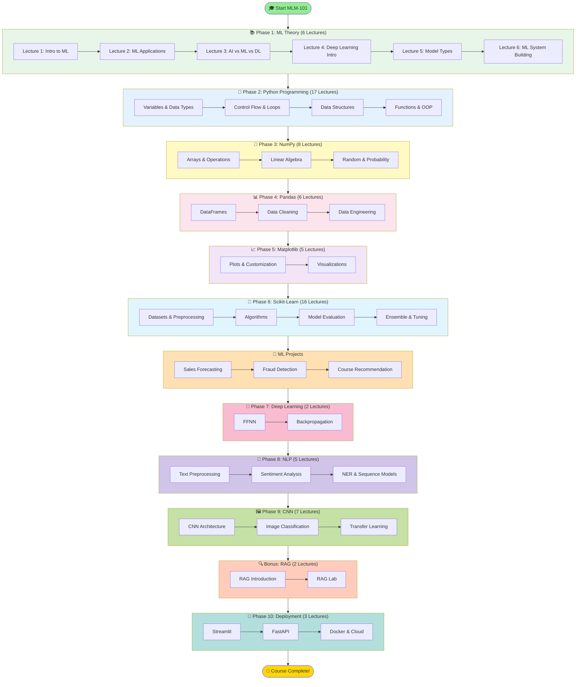

# Course Roadmap

Complete learning path for the Machine Learning Mastery (MLM-101) course.

## Mermaid Diagram (renders in GitHub)



## Detailed Course Roadmap

```
┌──────────────────────────────────────────────────────────────────┐
│           MACHINE LEARNING MASTERY (MLM-101)                     │
│                    Complete Roadmap                              │
│                   Total: 85 Lectures                             │
└──────────────────────────────────────────────────────────────────┘

                          START HERE
                              ↓
┌──────────────────────────────────────────────────────────────────┐
│ 📚 PHASE 1: MACHINE LEARNING THEORY (6 Lectures)                 │
├──────────────────────────────────────────────────────────────────┤
│ Duration: 1 week                                                 │
│                                                                  │
│ ✓ Lecture 1: Introduction to Machine Learning                   │
│ ✓ Lecture 2: Applications of Machine Learning                   │
│ ✓ Lecture 3: AI, ML, and DL Differences                        │
│ ✓ Lecture 4: Intro to Deep Learning and Neural Networks        │
│ ✓ Lecture 5: Types of Models/Algorithms                        │
│ ✓ Lecture 6: Steps of Building Machine Learning System         │
│                                                                  │
│ 🎯 Learning Outcome: Understand ML fundamentals                 │
└──────────────────────────────────────────────────────────────────┘
                              ↓
┌──────────────────────────────────────────────────────────────────┐
│ 🐍 PHASE 2: PYTHON PROGRAMMING FOR ML (17 Lectures)             │
├──────────────────────────────────────────────────────────────────┤
│ Duration: 2-3 weeks                                              │
│                                                                  │
│ Lectures 7-10: Basics                                           │
│  • Variables, Data Types, Operators, Control Flow              │
│                                                                  │
│ Lectures 11-15: Data Structures                                │
│  • Loops, Lists, Tuples, Sets, Dictionaries                   │
│                                                                  │
│ Lectures 16-23: Advanced                                        │
│  • Functions, OOP, Modules, RegEx, Error Handling              │
│                                                                  │
│ 🎯 Learning Outcome: Python proficiency for data science        │
└──────────────────────────────────────────────────────────────────┘
                              ↓
┌──────────────────────────────────────────────────────────────────┐
│ 🔢 PHASE 3: NUMPY FOR DATA COMPUTING (8 Lectures)               │
├──────────────────────────────────────────────────────────────────┤
│ Duration: 1 week                                                 │
│                                                                  │
│ Lectures 24-31:                                                 │
│  • Array Creation & Manipulation                               │
│  • Mathematical Operations                                      │
│  • Matrices & Linear Algebra                                   │
│  • Random Numbers & Probability                                │
│                                                                  │
│ 🎯 Learning Outcome: Numerical computing skills                 │
│ 📓 Practice: notebooks/01_basics/                               │
└──────────────────────────────────────────────────────────────────┘
                              ↓
┌──────────────────────────────────────────────────────────────────┐
│ 📊 PHASE 4: PANDAS FOR DATA ANALYSIS (6 Lectures)               │
├──────────────────────────────────────────────────────────────────┤
│ Duration: 1 week                                                 │
│                                                                  │
│ Lectures 32-37:                                                 │
│  • DataFrames & Series                                         │
│  • Reading CSV/JSON                                            │
│  • Data Cleaning & Engineering                                 │
│  • Data Analysis Techniques                                    │
│                                                                  │
│ 🎯 Learning Outcome: Data manipulation mastery                  │
└──────────────────────────────────────────────────────────────────┘
                              ↓
┌──────────────────────────────────────────────────────────────────┐
│ 📈 PHASE 5: MATPLOTLIB FOR VISUALIZATION (5 Lectures)           │
├──────────────────────────────────────────────────────────────────┤
│ Duration: 3-4 days                                               │
│                                                                  │
│ Lectures 38-42:                                                 │
│  • Creating Plots                                              │
│  • Customization                                               │
│  • Visualizations                                              │
│                                                                  │
│ 🎯 Learning Outcome: Data visualization skills                  │
└──────────────────────────────────────────────────────────────────┘
                              ↓
┌──────────────────────────────────────────────────────────────────┐
│ 🤖 PHASE 6: MACHINE LEARNING WITH SCIKIT-LEARN (16 Lectures)    │
├──────────────────────────────────────────────────────────────────┤
│ Duration: 2-3 weeks                                              │
│                                                                  │
│ Lectures 43-46: Foundations                                     │
│  • Introduction, Datasets, Preprocessing                       │
│                                                                  │
│ Lectures 47-54: Algorithms                                      │
│  • Regression & Classification                                 │
│  • DecisionTree, LinearRegression                              │
│                                                                  │
│ Lectures 55-58: Advanced                                        │
│  • Ensembles, Gradient Boosting                                │
│  • Hyperparameter Tuning                                       │
│                                                                  │
│ 🎯 Learning Outcome: Build & evaluate ML models                 │
│ 📓 Practice: notebooks/01_basics/hyperparameter_tuning.ipynb    │
└──────────────────────────────────────────────────────────────────┘
                              ↓
┌──────────────────────────────────────────────────────────────────┐
│ 🚀 MACHINE LEARNING PROJECTS (3 Projects)                       │
├──────────────────────────────────────────────────────────────────┤
│ Duration: 2-3 weeks                                              │
│                                                                  │
│ Lecture 59: Project I - Sales Forecasting                      │
│  📂 projects/01_sales_forecasting/                              │
│  🎯 Goal: Predict future sales using regression                │
│                                                                  │
│ Lecture 60: Project II - Credit Card Fraud Detection           │
│  📂 projects/02_fraud_detection/                                │
│  🎯 Goal: Classify transactions as fraud/legitimate            │
│                                                                  │
│ Lecture 61: Project III - Course Recommendation                │
│  📂 projects/03_course_recommendation/                          │
│  🎯 Goal: Recommend courses based on preferences               │
│                                                                  │
│ 🎯 Learning Outcome: End-to-end project experience             │
└──────────────────────────────────────────────────────────────────┘
                              ↓
┌──────────────────────────────────────────────────────────────────┐
│ 🧠 PHASE 7: DEEP LEARNING (2 Lectures)                          │
├──────────────────────────────────────────────────────────────────┤
│ Duration: 1 week                                                 │
│                                                                  │
│ Lecture 67-68:                                                  │
│  • Introduction to Deep Learning                               │
│  • Feedforward Neural Networks (FFNN)                          │
│  • Backpropagation                                             │
│                                                                  │
│ 📓 Practice: notebooks/02_deep_learning/ffnn_classification.ipynb│
│                                                                  │
│ 🎯 Learning Outcome: Neural network fundamentals                │
└──────────────────────────────────────────────────────────────────┘
                              ↓
┌──────────────────────────────────────────────────────────────────┐
│ 💬 PHASE 8: NATURAL LANGUAGE PROCESSING (5 Lectures)            │
├──────────────────────────────────────────────────────────────────┤
│ Duration: 1-2 weeks                                              │
│                                                                  │
│ Lectures 69-73:                                                 │
│  • NLP Introduction                                            │
│  • Text Preprocessing                                          │
│  • Sentiment Analysis                                          │
│  • Named Entity Recognition (NER)                              │
│  • Sequence Models (RNN, LSTM)                                 │
│                                                                  │
│ 📓 Practice: notebooks/03_nlp/                                  │
│  • sentiment_analysis_scikit.ipynb                             │
│  • named_entity_recognition.ipynb                              │
│                                                                  │
│ 🎯 Learning Outcome: Text processing & analysis                 │
└──────────────────────────────────────────────────────────────────┘
                              ↓
┌──────────────────────────────────────────────────────────────────┐
│ 🖼️ PHASE 9: CONVOLUTIONAL NEURAL NETWORKS (7 Lectures)         │
├──────────────────────────────────────────────────────────────────┤
│ Duration: 1-2 weeks                                              │
│                                                                  │
│ Lectures 74-80:                                                 │
│  • CNN Architecture                                            │
│  • Padding & Pooling                                           │
│  • Image Classification                                        │
│  • Transfer Learning (ResNet50, VGG16)                         │
│                                                                  │
│ 📓 Practice: notebooks/02_deep_learning/                        │
│  • cnn_image_classification.ipynb                              │
│  • transfer_learning_resnet50.ipynb                            │
│  • transfer_learning_vgg16.ipynb                               │
│                                                                  │
│ 🎯 Learning Outcome: Image processing with deep learning        │
└──────────────────────────────────────────────────────────────────┘
                              ↓
┌──────────────────────────────────────────────────────────────────┐
│ 🔍 BONUS PHASE: RAG (Retrieval-Augmented Generation) (2 Lectures)│
├──────────────────────────────────────────────────────────────────┤
│ Duration: 3-4 days                                               │
│                                                                  │
│ Lectures 81-82:                                                 │
│  • Introduction to RAG                                         │
│  • RAG Implementation with LangChain                           │
│  • Vector Databases (Pinecone, ChromaDB)                       │
│                                                                  │
│ 📓 Practice: notebooks/04_rag/                                  │
│  • rag_langchain_book_pdf.ipynb                                │
│  • rag_langchain_pinecone_chromadb.ipynb                       │
│                                                                  │
│ 🎯 Learning Outcome: Build AI-powered Q&A systems               │
└──────────────────────────────────────────────────────────────────┘
                              ↓
┌──────────────────────────────────────────────────────────────────┐
│ 🚀 PHASE 10: DEPLOYMENT & CONCLUSION (5 Lectures)               │
├──────────────────────────────────────────────────────────────────┤
│ Duration: 1 week                                                 │
│                                                                  │
│ Lectures 62-64: Streamlit Deployment                           │
│  • Streamlit Basics                                            │
│  • Building Streamlit Projects                                │
│  • Hosting on Streamlit Cloud                                 │
│                                                                  │
│ Lecture 83: Advanced Deployment                                │
│  • FastAPI                                                     │
│  • Docker                                                      │
│  • Cloud Hosting (AWS, Azure, Heroku)                         │
│                                                                  │
│ 📓 Practice: notebooks/05_deployment/                           │
│  • 01_model_serialization.ipynb                                │
│  • 02_serving_fastapi.ipynb                                    │
│  • 04_docker_and_containerization.ipynb                        │
│                                                                  │
│ Lectures 84-85: Wrap-Up                                        │
│  • Course Summary                                              │
│  • Recommendations & Next Steps                                │
│                                                                  │
│ 🎯 Learning Outcome: Production-ready ML deployment             │
└──────────────────────────────────────────────────────────────────┘
                              ↓
                    🎉 COURSE COMPLETE! 🎉
                              ↓
┌──────────────────────────────────────────────────────────────────┐
│                     NEXT STEPS                                   │
├──────────────────────────────────────────────────────────────────┤
│ ✓ Build personal projects                                       │
│ ✓ Contribute to open source                                     │
│ ✓ Participate in Kaggle competitions                            │
│ ✓ Continue learning (advanced courses)                          │
│ ✓ Join ML communities                                           │
│ ✓ Apply for ML positions                                        │
└──────────────────────────────────────────────────────────────────┘
```

## Learning Path Summary

### Beginner Path (Weeks 1-6)

1. **ML Theory** → Understand concepts
2. **Python** → Learn programming fundamentals
3. **NumPy & Pandas** → Data manipulation
4. **Matplotlib** → Visualization
5. **Scikit-learn Basics** → First ML models

### Intermediate Path (Weeks 7-10)

1. **Advanced Scikit-learn** → Complex algorithms
2. **ML Projects** → Apply knowledge
3. **Deep Learning** → Neural networks
4. **Deployment** → Streamlit basics

### Advanced Path (Weeks 11-14)

1. **NLP** → Text processing
2. **CNN** → Image processing
3. **RAG** → AI systems
4. **Advanced Deployment** → FastAPI, Docker, Cloud

## Time Estimates

| Phase    | Lectures | Estimated Time | Difficulty |
| -------- | -------- | -------------- | ---------- |
| Phase 1  | 6        | 1 week         | ⭐         |
| Phase 2  | 17       | 2-3 weeks      | ⭐⭐       |
| Phase 3  | 8        | 1 week         | ⭐⭐       |
| Phase 4  | 6        | 1 week         | ⭐⭐       |
| Phase 5  | 5        | 3-4 days       | ⭐⭐       |
| Phase 6  | 16       | 2-3 weeks      | ⭐⭐⭐     |
| Projects | 3        | 2-3 weeks      | ⭐⭐⭐     |
| Phase 7  | 2        | 1 week         | ⭐⭐⭐⭐   |
| Phase 8  | 5        | 1-2 weeks      | ⭐⭐⭐⭐   |
| Phase 9  | 7        | 1-2 weeks      | ⭐⭐⭐⭐   |
| RAG      | 2        | 3-4 days       | ⭐⭐⭐⭐   |
| Phase 10 | 5        | 1 week         | ⭐⭐⭐     |

**Total:** 12-16 weeks (3-4 months) at moderate pace

## Converting to Image

```bash
# Install Mermaid CLI
npm install -g @mermaid-js/mermaid-cli

# Convert to SVG (recommended for roadmaps)
mmdc -i course-roadmap.md -o course-roadmap.svg

# Convert to PNG
mmdc -i course-roadmap.md -o course-roadmap.png -w 1920 -H 1080
```

Or use: https://mermaid.live/
