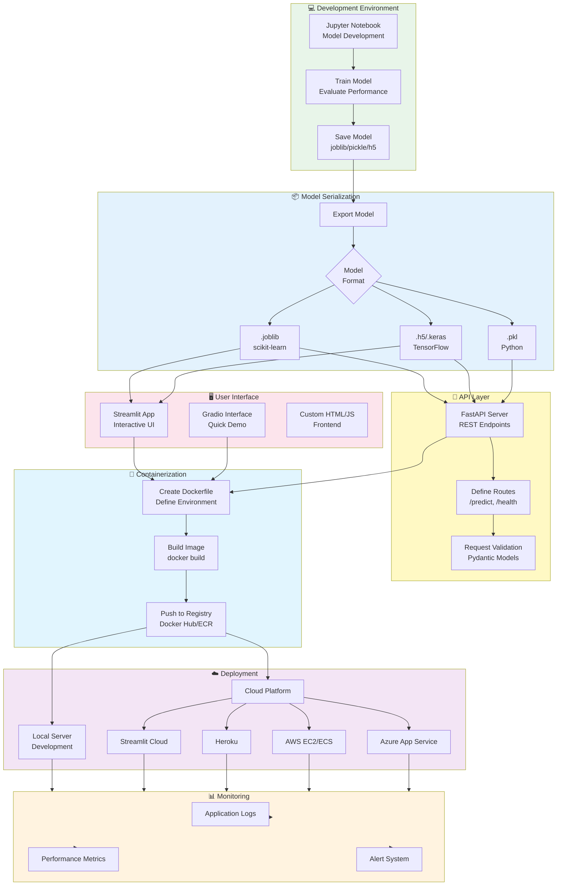

# Deployment Flow Diagram

This diagram shows the complete deployment pipeline for ML models in the MLM-101 course.

## Mermaid Diagram (renders in GitHub)



## Detailed Deployment Pipeline

```
┌──────────────────────────────────────────────────────────────────┐
│                    DEPLOYMENT FLOW                               │
└──────────────────────────────────────────────────────────────────┘

STAGE 1: MODEL DEVELOPMENT
┌─────────────────────────────────────────────┐
│  Jupyter Notebook                           │
│  ┌───────────────────────────────┐          │
│  │ 1. Load Data                  │          │
│  │ 2. Preprocess                 │          │
│  │ 3. Train Model                │          │
│  │ 4. Evaluate (R², Accuracy)    │          │
│  │ 5. Tune Hyperparameters       │          │
│  └───────────────┬───────────────┘          │
└──────────────────┼──────────────────────────┘
                   │
                   ▼
STAGE 2: MODEL SERIALIZATION
┌─────────────────────────────────────────────┐
│  Save Trained Model                         │
│                                             │
│  Option A: scikit-learn                    │
│  ┌─────────────────────────────────┐       │
│  │ import joblib                   │       │
│  │ joblib.dump(model, 'model.pkl') │       │
│  └─────────────────────────────────┘       │
│                                             │
│  Option B: TensorFlow/Keras                │
│  ┌─────────────────────────────────┐       │
│  │ model.save('model.h5')          │       │
│  └─────────────────────────────────┘       │
│                                             │
│  Option C: ONNX (Universal)                │
│  ┌─────────────────────────────────┐       │
│  │ import onnx                     │       │
│  │ onnx.save(model, 'model.onnx')  │       │
│  └─────────────────┬───────────────┘       │
└────────────────────┼─────────────────────────┘
                     │
                     ▼
STAGE 3: API DEVELOPMENT
┌─────────────────────────────────────────────┐
│  FastAPI REST API                           │
│  ┌─────────────────────────────────┐        │
│  │ from fastapi import FastAPI     │        │
│  │ import joblib                   │        │
│  │                                 │        │
│  │ app = FastAPI()                 │        │
│  │ model = joblib.load('model.pkl')│        │
│  │                                 │        │
│  │ @app.post("/predict")           │        │
│  │ def predict(data: InputData):   │        │
│  │     return model.predict(data)  │        │
│  └─────────────────┬───────────────┘        │
└────────────────────┼──────────────────────────┘
                     │
        ┌────────────┼────────────┐
        │            │            │
        ▼            ▼            ▼
STAGE 4: USER INTERFACE OPTIONS

┌──────────────┐ ┌──────────────┐ ┌──────────────┐
│  Streamlit   │ │   Gradio     │ │  Custom Web  │
│              │ │              │ │              │
│  Quick UI    │ │  Simple Demo │ │  Full Control│
│  Builder     │ │  Interface   │ │  HTML/CSS/JS │
└──────┬───────┘ └──────┬───────┘ └──────┬───────┘
       │                │                │
       └────────────────┼────────────────┘
                        │
                        ▼
STAGE 5: CONTAINERIZATION
┌─────────────────────────────────────────────┐
│  Docker Container                           │
│  ┌─────────────────────────────────┐        │
│  │ Dockerfile                      │        │
│  │ ─────────────                   │        │
│  │ FROM python:3.10-slim          │        │
│  │ WORKDIR /app                    │        │
│  │ COPY requirements.txt .         │        │
│  │ RUN pip install -r requirements │        │
│  │ COPY . .                        │        │
│  │ CMD ["uvicorn", "app:app"]      │        │
│  └─────────────────┬───────────────┘        │
└────────────────────┼──────────────────────────┘
                     │
                     ▼
┌─────────────────────────────────────────────┐
│  Build & Push Image                         │
│  ┌─────────────────────────────────┐        │
│  │ docker build -t myapp:latest .  │        │
│  │ docker push myapp:latest        │        │
│  └─────────────────┬───────────────┘        │
└────────────────────┼──────────────────────────┘
                     │
                     ▼
STAGE 6: DEPLOYMENT PLATFORMS
┌───────────────────────────────────────────────────────┐
│                                                       │
│  ┌──────────────┐  ┌──────────────┐  ┌─────────────┐│
│  │ Streamlit    │  │   Heroku     │  │  AWS EC2/   ││
│  │   Cloud      │  │              │  │    ECS      ││
│  │ (Free Tier)  │  │ (Free Tier)  │  │ (Scalable)  ││
│  └──────┬───────┘  └──────┬───────┘  └──────┬──────┘│
│         │                 │                  │       │
│  ┌──────────────┐  ┌──────────────┐  ┌─────────────┐│
│  │   Azure      │  │   Google     │  │   Railway   ││
│  │ App Service  │  │  Cloud Run   │  │             ││
│  └──────────────┘  └──────────────┘  └─────────────┘│
└───────────────────────────────────────────────────────┘
                     │
                     ▼
STAGE 7: MONITORING & MAINTENANCE
┌─────────────────────────────────────────────┐
│  Monitor Performance                        │
│  ┌─────────────────────────────────┐        │
│  │ • Application Logs              │        │
│  │ • Response Times                │        │
│  │ • Error Rates                   │        │
│  │ • Model Drift Detection         │        │
│  │ • Resource Usage (CPU, Memory)  │        │
│  └─────────────────────────────────┘        │
│                                             │
│  Tools: CloudWatch, Datadog, Prometheus    │
└─────────────────────────────────────────────┘
                     │
                     ▼
┌─────────────────────────────────────────────┐
│  Continuous Improvement                     │
│  ┌─────────────────────────────────┐        │
│  │ • Collect user feedback         │        │
│  │ • Retrain with new data         │        │
│  │ • Update model version          │        │
│  │ • Deploy new version            │        │
│  └─────────────────────────────────┘        │
└─────────────────────────────────────────────┘
```

## Deployment Checklist

### ✅ Pre-Deployment

- [ ] Model trained and evaluated
- [ ] Model serialized (.pkl, .h5, .joblib)
- [ ] API endpoints tested locally
- [ ] Input validation implemented
- [ ] Error handling added
- [ ] Unit tests written
- [ ] Dependencies documented (requirements.txt)
- [ ] Environment variables configured

### ✅ Containerization

- [ ] Dockerfile created
- [ ] .dockerignore added
- [ ] Image builds successfully
- [ ] Container runs locally
- [ ] Image pushed to registry
- [ ] docker-compose.yml configured (if needed)

### ✅ Deployment

- [ ] Platform selected (Streamlit Cloud, Heroku, AWS, etc.)
- [ ] Secrets/API keys configured
- [ ] Environment variables set
- [ ] Deployed to staging environment
- [ ] Tested in staging
- [ ] Deployed to production
- [ ] Custom domain configured (optional)

### ✅ Post-Deployment

- [ ] Health check endpoint working
- [ ] Monitoring enabled
- [ ] Logging configured
- [ ] Alert system set up
- [ ] Backup strategy defined
- [ ] Rollback plan documented
- [ ] Performance benchmarked

## Deployment Commands Reference

### Local Development

```bash
# FastAPI
uvicorn app:app --reload --port 8000

# Streamlit
streamlit run app.py

# Gradio
python app.py
```

### Docker

```bash
# Build image
docker build -t mlm-sales-app .

# Run container
docker run -p 8000:8000 mlm-sales-app

# Using docker-compose
docker-compose up --build
```

### Streamlit Cloud

```bash
# Push to GitHub
git push origin main

# Deploy via Streamlit Cloud UI
# https://streamlit.io/cloud
```

### Heroku

```bash
heroku login
heroku create mlm-sales-app
git push heroku main
heroku open
```

### AWS EC2

```bash
# SSH into instance
ssh -i key.pem ec2-user@<instance-ip>

# Pull Docker image
docker pull your-registry/mlm-app:latest

# Run container
docker run -d -p 80:8000 your-registry/mlm-app:latest
```

## Platform Comparison

| Platform              | Cost      | Ease       | Scalability | Best For                    |
| --------------------- | --------- | ---------- | ----------- | --------------------------- |
| **Streamlit Cloud**   | Free      | ⭐⭐⭐⭐⭐ | ⭐⭐⭐      | Quick demos, prototypes     |
| **Heroku**            | Free tier | ⭐⭐⭐⭐   | ⭐⭐⭐      | Small apps, testing         |
| **Railway**           | Free tier | ⭐⭐⭐⭐   | ⭐⭐⭐⭐    | Modern apps, APIs           |
| **AWS EC2**           | Pay-as-go | ⭐⭐⭐     | ⭐⭐⭐⭐⭐  | Production, enterprise      |
| **Google Cloud Run**  | Pay-as-go | ⭐⭐⭐⭐   | ⭐⭐⭐⭐⭐  | Serverless, containers      |
| **Azure App Service** | Pay-as-go | ⭐⭐⭐     | ⭐⭐⭐⭐⭐  | Enterprise, Microsoft stack |

## Converting to Image

```bash
# Install Mermaid CLI
npm install -g @mermaid-js/mermaid-cli

# Convert to PNG
mmdc -i deployment-flow.md -o deployment-flow.png

# Convert to SVG
mmdc -i deployment-flow.md -o deployment-flow.svg
```

Or use: https://mermaid.live/
