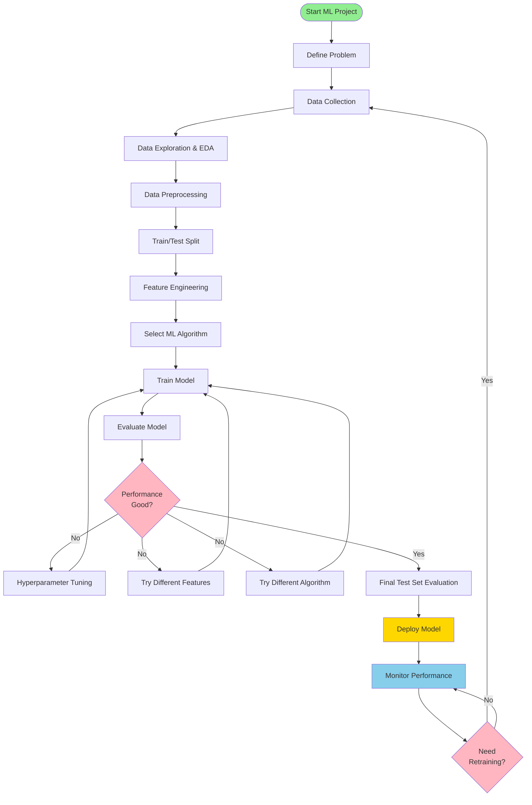

# ML Workflow Diagram

This diagram shows the typical machine learning workflow used throughout the MLM-101 course.

## Mermaid Diagram (renders in GitHub)



## ASCII Diagram (for terminals)

```
┌─────────────────────────────────────────────────────────────┐
│                    ML WORKFLOW                              │
└─────────────────────────────────────────────────────────────┘

    ┌──────────────────┐
    │ Define Problem   │
    └────────┬─────────┘
             │
             ▼
    ┌──────────────────┐
    │ Data Collection  │
    └────────┬─────────┘
             │
             ▼
    ┌──────────────────┐
    │  Data Exploration│
    │  & EDA           │
    └────────┬─────────┘
             │
             ▼
    ┌──────────────────┐
    │ Data Preprocessing│
    └────────┬─────────┘
             │
             ▼
    ┌──────────────────┐
    │ Train/Test Split │
    └────────┬─────────┘
             │
             ▼
    ┌──────────────────┐
    │Feature Engineering│
    └────────┬─────────┘
             │
             ▼
    ┌──────────────────┐
    │Select Algorithm  │
    └────────┬─────────┘
             │
             ▼
    ┌──────────────────┐
    │  Train Model     │
    └────────┬─────────┘
             │
             ▼
    ┌──────────────────┐
    │ Evaluate Model   │
    └────────┬─────────┘
             │
             ▼
        ╔═══════╗
        ║ Good? ║
        ╚═══╤═══╝
            │
    ┌───────┼────────┐
    │ No            │ Yes
    │               │
    ▼               ▼
┌────────┐    ┌──────────┐
│  Tune  │    │  Deploy  │
│Hyperpar│    │  Model   │
│ ameter │    └────┬─────┘
└───┬────┘         │
    │              ▼
    │      ┌──────────────┐
    │      │   Monitor    │
    │      │ Performance  │
    │      └──────┬───────┘
    │             │
    └─────────────┘
```

## Phase-by-Phase Breakdown

### Phase 1: Problem Definition

- Identify business problem
- Define success metrics
- Determine ML task type (classification, regression, clustering)

### Phase 2: Data Collection

- Gather relevant datasets
- Identify data sources
- Ensure data quality

### Phase 3: Exploratory Data Analysis (EDA)

- Statistical analysis
- Visualization
- Identify patterns and anomalies

### Phase 4: Data Preprocessing

- Handle missing values
- Remove duplicates
- Encode categorical variables
- Scale/normalize features

### Phase 5: Feature Engineering

- Create new features
- Select important features
- Transform features

### Phase 6: Model Training

- Choose algorithm (Decision Tree, Random Forest, Neural Network, etc.)
- Train on training set
- Cross-validation

### Phase 7: Model Evaluation

- Test on validation set
- Calculate metrics (Accuracy, Precision, Recall, R², MSE)
- Compare with baseline

### Phase 8: Hyperparameter Tuning

- Grid search
- Random search
- Optimize parameters

### Phase 9: Deployment

- Save model (pickle, joblib, h5)
- Create API (FastAPI, Flask)
- Build web interface (Streamlit, Gradio)
- Containerize (Docker)

### Phase 10: Monitoring

- Track performance metrics
- Detect data drift
- Retrain when necessary

## Tools Used in MLM-101

| Phase               | Tools/Libraries                 |
| ------------------- | ------------------------------- |
| Data Collection     | pandas, APIs                    |
| EDA                 | matplotlib, seaborn, pandas     |
| Preprocessing       | scikit-learn, pandas            |
| Feature Engineering | pandas, numpy                   |
| Model Training      | scikit-learn, TensorFlow, Keras |
| Evaluation          | scikit-learn metrics            |
| Deployment          | Streamlit, FastAPI, Docker      |
| Monitoring          | Custom scripts, MLflow          |

## Converting to Image

To convert this Mermaid diagram to PNG:

### Method 1: Using GitHub

- The Mermaid diagram automatically renders on GitHub
- Take a screenshot

### Method 2: Using Mermaid CLI

```bash
npm install -g @mermaid-js/mermaid-cli
mmdc -i ml-workflow.md -o ml-workflow.png
```

### Method 3: Using Online Tools

- https://mermaid.live/
- Paste the Mermaid code
- Download as PNG/SVG
