# Project Architecture Diagram

This diagram shows the architecture of the MLM-101 projects (Sales Forecasting, Fraud Detection, Course Recommendation).

## Mermaid Diagram (renders in GitHub)

```mermaid
flowchart LR
    subgraph Input["📥 Input Layer"]
        CSV[CSV Dataset]
        User[User Input]
    end

    subgraph Data["🔄 Data Processing"]
        Load[Load Data<br/>pandas]
        Clean[Data Cleaning<br/>Handle Missing Values]
        Encode[Encoding<br/>OneHotEncoder]
        Split[Train/Test Split<br/>sklearn]
    end

    subgraph Model["🤖 Model Layer"]
        Train[Model Training<br/>DecisionTree/RandomForest]
        Eval[Model Evaluation<br/>Metrics]
        Save[Save Model<br/>joblib/pickle]
    end

    subgraph Prediction["🎯 Prediction Layer"]
        Load2[Load Saved Model]
        Predict[Make Predictions]
        Results[Return Results]
    end

    subgraph Deploy["🚀 Deployment Layer"]
        API[REST API<br/>FastAPI]
        WebApp[Web Interface<br/>Streamlit]
        Docker[Container<br/>Docker]
    end

    CSV --> Load
    Load --> Clean
    Clean --> Encode
    Encode --> Split
    Split --> Train
    Train --> Eval
    Eval --> Save

    User --> Load2
    Save -.-> Load2
    Load2 --> Predict
    Predict --> Results

    Results --> API
    Results --> WebApp
    API --> Docker
    WebApp --> Docker

    style Input fill:#E8F5E9
    style Data fill:#E3F2FD
    style Model fill:#FFF9C4
    style Prediction fill:#FCE4EC
    style Deploy fill:#F3E5F5
```



## Detailed Architecture

```
┌─────────────────────────────────────────────────────────────────┐
│                    PROJECT ARCHITECTURE                         │
└─────────────────────────────────────────────────────────────────┘

┌──────────────────────────────────────────────────────────────────┐
│ 1. DATA LAYER                                                    │
│                                                                  │
│  projects/XX_project_name/                                       │
│  ├── data/                                                       │
│  │   └── dataset.csv  ───────┐                                  │
│  │                            │                                  │
│  └── models/                  │                                  │
│      └── saved_model.joblib   │                                  │
└───────────────────────────────┼──────────────────────────────────┘
                                │
                                ▼
┌──────────────────────────────────────────────────────────────────┐
│ 2. PREPROCESSING PIPELINE                                        │
│                                                                  │
│  ┌─────────────┐   ┌──────────────┐   ┌─────────────┐          │
│  │ Load CSV    │──▶│ Clean Data   │──▶│   Encode    │          │
│  │  (pandas)   │   │ (dropna, etc)│   │(OneHotEnc)  │          │
│  └─────────────┘   └──────────────┘   └──────┬──────┘          │
│                                               │                  │
│  ┌─────────────────────────────────────────────┘                │
│  │                                                               │
│  ▼                                                               │
│  ┌─────────────┐   ┌──────────────┐                            │
│  │ Train/Test  │──▶│   Feature    │                            │
│  │   Split     │   │  Transform   │                            │
│  └─────────────┘   └──────┬───────┘                            │
└────────────────────────────┼────────────────────────────────────┘
                             │
                             ▼
┌──────────────────────────────────────────────────────────────────┐
│ 3. MODEL LAYER                                                   │
│                                                                  │
│  ┌──────────────────────┐                                       │
│  │ Algorithm Selection  │                                       │
│  │  • DecisionTree      │                                       │
│  │  • RandomForest      │                                       │
│  │  • GradientBoosting  │                                       │
│  └──────────┬───────────┘                                       │
│             │                                                    │
│             ▼                                                    │
│  ┌──────────────────────┐   ┌──────────────────────┐           │
│  │   Model Training     │──▶│  Model Evaluation    │           │
│  │   (fit on X_train)   │   │  (R², Accuracy, F1)  │           │
│  └──────────────────────┘   └──────────┬───────────┘           │
│                                         │                        │
│                                         ▼                        │
│                              ┌──────────────────────┐           │
│                              │   Save Model         │           │
│                              │   (joblib.dump)      │           │
│                              └──────────────────────┘           │
└──────────────────────────────────────────────────────────────────┘
                                         │
                                         ▼
┌──────────────────────────────────────────────────────────────────┐
│ 4. PREDICTION LAYER                                              │
│                                                                  │
│  ┌──────────────────────┐   ┌──────────────────────┐           │
│  │   Load Saved Model   │──▶│  Preprocess Input    │           │
│  │   (joblib.load)      │   │  (same as training)  │           │
│  └──────────────────────┘   └──────────┬───────────┘           │
│                                         │                        │
│                                         ▼                        │
│                              ┌──────────────────────┐           │
│                              │  Make Prediction     │           │
│                              │  (model.predict)     │           │
│                              └──────────┬───────────┘           │
│                                         │                        │
│                                         ▼                        │
│                              ┌──────────────────────┐           │
│                              │  Return Results      │           │
│                              └──────────────────────┘           │
└──────────────────────────────────────────────────────────────────┘
                                         │
                                         ▼
┌──────────────────────────────────────────────────────────────────┐
│ 5. DEPLOYMENT LAYER                                              │
│                                                                  │
│  ┌─────────────────┐  ┌─────────────────┐  ┌────────────────┐  │
│  │  Command Line   │  │   Web App       │  │   REST API     │  │
│  │  (Python CLI)   │  │  (Streamlit)    │  │  (FastAPI)     │  │
│  └────────┬────────┘  └────────┬────────┘  └────────┬───────┘  │
│           │                    │                     │           │
│           └────────────────────┼─────────────────────┘           │
│                                │                                 │
│                                ▼                                 │
│                    ┌───────────────────────┐                    │
│                    │   Docker Container    │                    │
│                    │   • Isolated Env      │                    │
│                    │   • Dependencies      │                    │
│                    │   • Port Mapping      │                    │
│                    └───────────────────────┘                    │
└──────────────────────────────────────────────────────────────────┘
```

## Component Details

### 1. Data Layer

**Location:** `projects/XX_project_name/data/`

**Files:**

- `sales_data.csv` - Historical sales data
- `fraud_data.csv` - Transaction data
- `course_data.csv` - Student preferences

**Purpose:** Store raw and processed datasets

### 2. Preprocessing Pipeline

**Libraries:**

- `pandas` - Data manipulation
- `sklearn.preprocessing` - Encoding, scaling
- `sklearn.model_selection` - Train/test split

**Steps:**

1. Load CSV with pandas
2. Handle missing values
3. Encode categorical variables (OneHotEncoder)
4. Split data (80/20 or 70/30)
5. Transform features

### 3. Model Layer

**Algorithms Used:**

- **Sales Forecasting:** DecisionTreeRegressor
- **Fraud Detection:** Classification algorithms
- **Course Recommendation:** DecisionTreeClassifier

**Training Process:**

```python
# Simplified workflow
model = DecisionTreeClassifier()
model.fit(X_train, y_train)
score = model.score(X_test, y_test)
joblib.dump(model, 'model.joblib')
```

### 4. Prediction Layer

**Input Sources:**

- User input (console, web form)
- API requests (JSON)
- Batch files (CSV)

**Process:**

1. Load saved model
2. Apply same preprocessing as training
3. Generate predictions
4. Format output

### 5. Deployment Layer

**Options:**

**A. Command Line Interface (CLI)**

```bash
python sales_forecasting.py
# Interactive prompts
```

**B. Streamlit Web App**

```bash
streamlit run sales_app.py
# Web interface at localhost:8501
```

**C. FastAPI REST API**

```bash
uvicorn app:app --reload
# API at localhost:8000
```

**D. Docker Container**

```bash
docker-compose up
# Containerized deployment
```

## Technology Stack

| Layer            | Technologies           |
| ---------------- | ---------------------- |
| Data             | pandas, CSV, NumPy     |
| Preprocessing    | scikit-learn, pandas   |
| Models           | scikit-learn, joblib   |
| CLI              | Python argparse        |
| Web UI           | Streamlit, Gradio      |
| API              | FastAPI, uvicorn       |
| Containerization | Docker, docker-compose |

## File Structure Per Project

```
projects/01_sales_forecasting/
├── sales_forecasting.py      # Training script
├── sales_app.py               # Streamlit app
├── requirements.txt           # Dependencies
├── README.md                  # Documentation
├── data/
│   └── sales_data.csv        # Dataset
└── models/
    └── sales_model.joblib    # Saved model
```

## Converting to Image

Use Mermaid Live Editor or CLI:

```bash
mmdc -i project-architecture.md -o project-architecture.png
```
